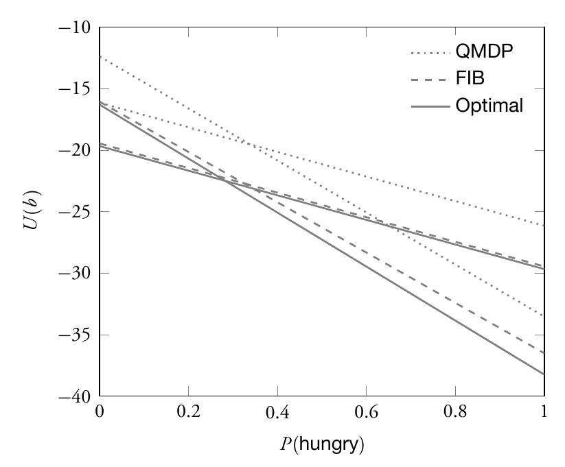

# dmubook-errata
Errata to Decision Making Under Uncertainty: Theory and Application

* Alg. 4.12 (line 4): replace ; with | to be consistent with the notation used in this section (Jon Cox)
* Eq. 6.11: switch a and s in the transition function to be consistent with the notation in the book (Max Egorov)
* Eq. 2.61: (v_i - \hat\mu) should be squared
* P. 59, sentence before eq. 3.3: replace u^1 with c^1 (David Wagner)
* Eq. 2.76: equals sign to should be \propto (Haruki Nishimura)
* Sec. 3.1.1: in independence condition, second \succ should be \succeq (Ellen Blaine)
* Fig. 6.6: some of the alpha vectors did not print correctly (noted by Yi-Chun Chen); the figure should look like this: 
